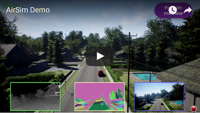

# Welcome to AirSim

AirSim is a simulator for drones (and soon other vehicles) built on Unreal Engine. Its open source, cross platform and supports hardware-in-loop with popular platforms such as PixHawk for physically and visually realistic simulations. It is developed as Unreal plugin that can simply be dropped in to any environment you want. 

Our goal is to develop AirSim as a platform for AI research where we can experiment with deep learning, computer vision and reinforcement learning algorithms for autonomous vehicles. For this purpose, AirSim also exposes APIs so you can retrieve sensor data, ground truth and camera images from the simulator. The APIs can also be used to send control commands to the vehicle in platform independent way.

# Development Status

This project is under heavy development. While we are working through our backlog of new features and known issues, we welcome contributions! Our current release is in beta and our APIs are subject to change.

# How to Get It
## Prerequisites
To get the best experience you will need PixHawk or compatible device and a RC controller. These enables so called "hardware-in-loop simulation" that provides more realistic experience. [Follow these instructions](docs/hil_setup.md) on how to get it, set it up and other alternatives.

## Windows
There are two ways to get AirSim working on your machine. Click on below links and follow the instructions.

1.  [Build it and use it with Unreal](docs/build.md)
2.  [Use the precompiled binaries](docs/use_precompiled.md)

## Linux
The official Linux build is expected to arrive in about couple of weeks. All our current code is cross-platform and CMake enabled so please feel free to playaround on other opearting systems and report any issues. We had love to make AirSim available on other platforms as well.

# How to Use It

## Manual flights
Just plugin PixHawk or compatible device in your USB port, turn on RC and press Play button in Unreal. You should be able to control drone in the simulator with RC and fly around. Press F1 key to view several available keyboard shortcuts.

[More detailed instructions and troubleshooting](docs/manual_flight.md)

## Gathering training data
There are two ways you can generate training data from AirSim. The easiest way is to simply press the record button on the lower right corner. This will start writing pose and images for each frame. If you had like more data and other features, [file the feature request](issues/) or contribute changes. The code for data logging is pretty simple to modify to your heart's desire.

More complex way to generate training data is by writing client code that uses our APIs. This allows you to be in full control of how, what, where and when you want to log data. See next section for more details.

## Programatic control
The AirSim exposes easy to use APIs to retrive data from the drone that includes ground truth, sensor data as well as various images. It also exposes APIs to control the drone in platform independent way. This allows you to use your code to control different drone platforms, for example, PixHawk or DJI Matrice, without any changes. These APIs are also available as seprate independent cross-platform library so you can deploy them on offboard computer on your vehicle and execute same code in real drone that you tested in simulator.

[More detailed instructions using APIs](docs/apis.md)

# Contribute
We welcome contributions to help advance research frontiers. 

[More on our design](docs/design.md)
[More on our code structure](docs/code structure.md)

# Licence
This project is released under MIT Licence. Please review [License file](LICENSE) for more details.