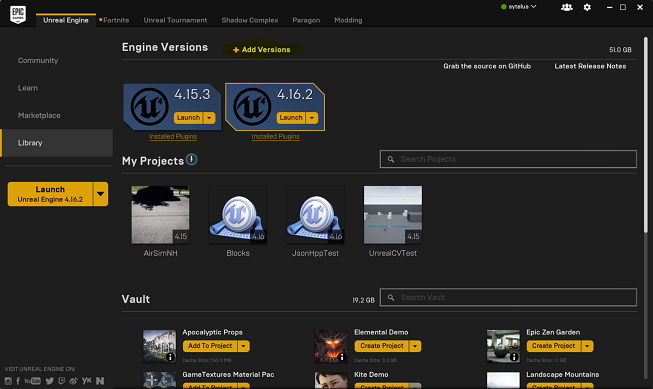

# How To Build and Install
**Make sure you have read the [prerequisites](prereq.md).**

## Install Unreal Engine
  1. Download the Unreal 4 engine from [unreal.com](https://www.unrealengine.com/dashboard). While the Unreal Engine is open source, cross platform and free to download, registration is still required as of this writing. 
  You need version 4.15. To get version 4.15 you may need to expand "Add versions" as shown below:

  

  **Note for 4.14 users**: If you had been using 4.14 or lower version with AirSim then upgrade is [simple and straight forward](unreal_upgrade.md).
  
  2. After the download, run the Epic Game Launcher and click the big yellow "Install" button under the Unreal Engine tab. 
 
  .

## Get the Code and Build

### Windows

  1. You need Visual Studio 2015 Update 3 (make sure to install VC++). Other versions haven't been tested.
  2. Start VS2015 x64 Native Tools Command Prompt. Create a folder for repo and run
  `git clone https://github.com/Microsoft/AirSim.git`
  3. Install [cmake](https://cmake.org/download/) which is used to build the rpclib submodule.
  4. Run `build.cmd` from the command line. If everything goes ok, it will copy all the binaries that you need to Unreal/Plugins folder in your repo. 
  This Plugins folder can then be simply copied to your Unreal environment.

### Linux

  1. See [Linux build](linux_build.md).
  
## Create Unreal Environment Project

Please go to [Unreal Demo Setup](unreal_demo.md) for full setup steps to get AirSim working in the Landscape Mountains environment.

### FAQ

If you run into problems, check the [FAQ](faq.md) and feel free to post issues on the [AirSim github](https://github.com/Microsoft/AirSim/issues).
