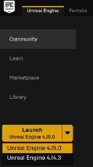

# How To Build and Install
**Make sure you have read the [prerequisites](prereq.md).**

## Install Unreal Engine
  1. Download the Unreal 4 engine from [unreal.com](https://www.unrealengine.com/dashboard). While the Unreal Engine is open source, cross platform and free to download, registration is still required as of this writing. 
  You need version 4.15. To get version 4.15 you may need to expand "Add versions" as shown below:

  

  **Note for 4.14 users**: If you had been using 4.14 or lower version with AirSim then upgrade is [simple and straight forward](unreal_upgrade.md).
  
  2. After the download, run the Epic Game Launcher and click the big yellow "Install" button under the Unreal Engine tab. 
 
  .

## Install Dependencies
AirSim code has two external dependencies:
  1. If you don't have already, [install Eigen](install_eigen.md).
  2. We use [rpclib](https://github.com/rpclib/rpclib.git) which is included as a git submodule.  So you don't have any setup to do for this one.

## Get the Code and Build
  1. You need Visual Studio 2015 Update 3 (make sure to install VC++). Other versions haven't been tested.
  2. Start VS2015 x64 Native Tools Command Prompt. Create a folder for repo and run
  `git clone https://github.com/Microsoft/AirSim.git`
  3. Install [cmake](https://cmake.org/download/) which is used to build the rpclib.
  4. Run `build.cmd` from the command line. If everything goes ok, it will copy all the binaries that you need to Unreal/Plugins folder in your repo. 
  This Plugins folder can then be simply copied to your Unreal environment.
  5. [Linux build](linux_build.md) is coming... stay tuned.
  
## Create Unreal Environment Project

See [Unreal AirSim Setup  Video](https://youtu.be/1oY8Qu5maQQ) that shows you all the setup steps in this document.

To run the simulator, you need an environment and its very easy to create one! [Unreal Marketplace](https://www.unrealengine.com/marketplace) has dozens of prebuilt extra-ordinarily detailed [environments](https://www.unrealengine.com/marketplace/content-cat/assets/environments) ranging from Moon to Mars and everything in between. The one we have used for testing is called [Modular Neighborhood Pack](https://www.unrealengine.com/marketplace/modular-neighborhood-pack) 
but you can use any environment.
  1. Either purchase an environment from Unreal Marketplace or choose one of the free ones such as [Infinity Blade series](https://www.unrealengine.com/marketplace/infinity-blade-plain-lands). 
  or the [Landscape Mountains](https://www.unrealengine.com/blog/new-on-marketplace-landscape-mountains).
  Alternatively, if you look under the Learn tab in Epic Game Launcher, you will find many free samples that you can use. One of our favorites is "A Boy and His Kite" which is a 100 square miles of highly detailed environment (caution: you will need *very* beefy PC to run it!).
  
  2. Once you have the environment, you can simply go to the Library tab of the Epic Game Launcher and add in to any project you like. We recommend creating a new blank C++ project with no Starter Content and add your environment in to it.
  3. If the environment comes with MatineeActor, delete it to avoid any startup demo sequences. There might be other ways to remove it as well, for example, click on Blueprints button, then Level Blueprint and then look at Begin Play event in Event Graph. You might want to disconnect any connections that may be starting "matinee".
  4. You might have to set default map for your project. For example, if you are using Modular Neighborhood Pack, set the Editor Starter Map as well as Game Default Map to Demo_Map in Project Settings > Maps & Modes..

## Install the AirSim Plugin
### Copy plugins folder
  Copy the `Unreal\Plugins` folder from the build you did in the above section into the root of your Unreal project's folder. The overall structure should look something like this: 

  

### Enable plugin for your Unreal project
  In your Unreal project's .uproject file, add `Plugins` section and key `AdditionalDependencies` so your project file looks like this:
  ```
    {
        "FileVersion": 3,
        "EngineAssociation": "4.14",
        "Category": "",
        "Description": "",
        "Modules": [
            {
                "Name": "MyUnrealProject",
                "Type": "Runtime",
                "LoadingPhase": "Default",
                "AdditionalDependencies": [
                    "AirSim"
                ]
            }
        ],
        "Plugins": [
            {
                "Name": "AirSim",
                "Enabled": true
            }
        ]
    }  
  ```

### Ready, Set, Go!
You are all ready to go now! 

1. Right click on the Unreal project .uproject file, then Generate Visual Studio Project files. 
2. Double click on .sln file to open the solution. 
3. Hit F5.
4. After Unreal Editor comes up, go to the World settings and select Game Mode = SimGameMode.
5. Make sure your environment has a Player Start component or add one. This is where the quadrotor will be placed.
6. Hit Play button.

Congratulations! You are now running AirSim in your own Unreal environment.

### FAQ

If you run into problems, check the [FAQ](faq.md) and feel free to post issues on the [AirSim github](https://github.com/Microsoft/AirSim/issues).
